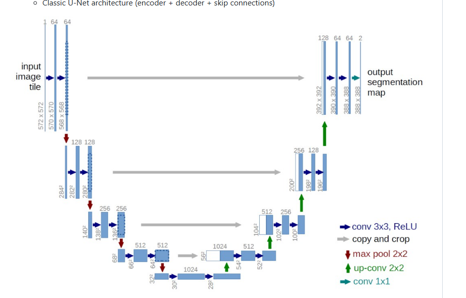
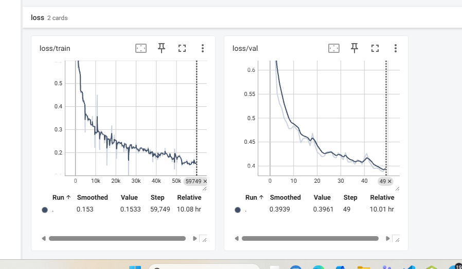
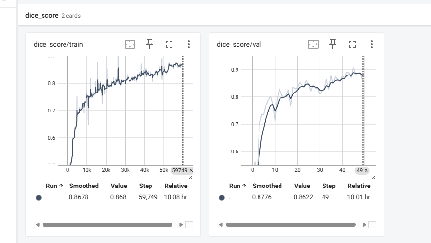
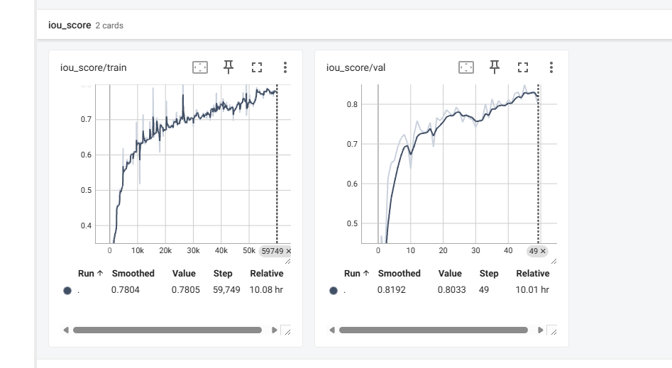
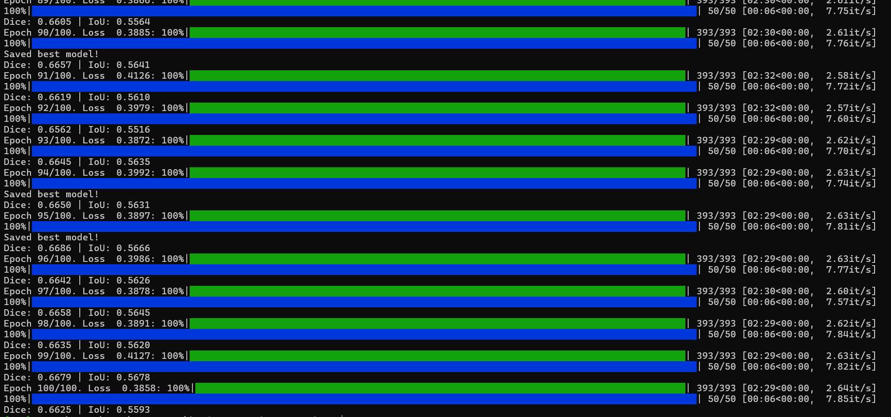
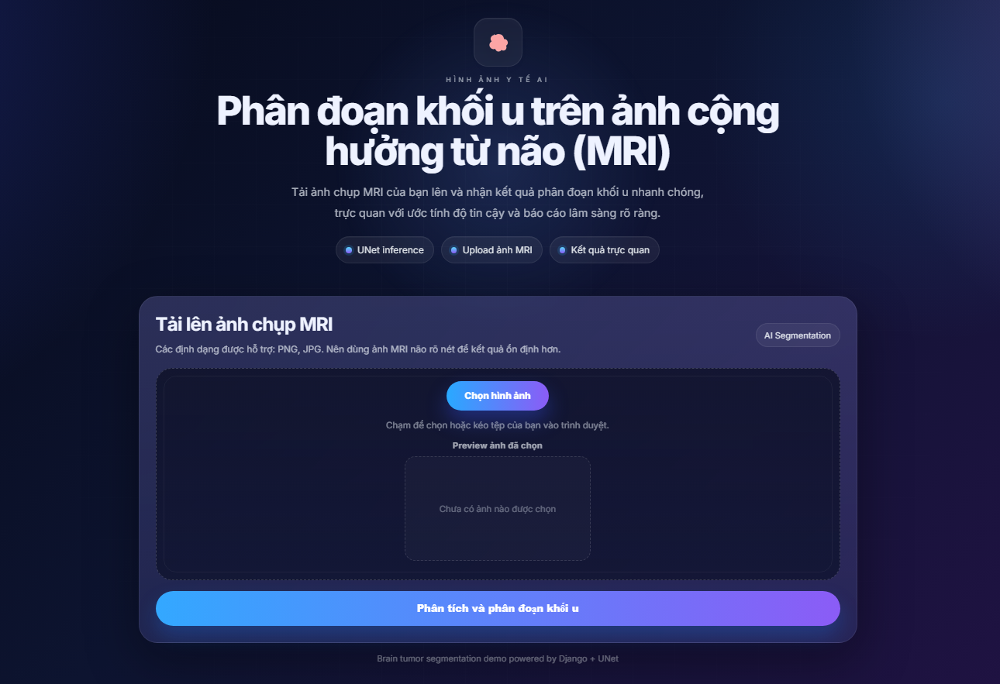
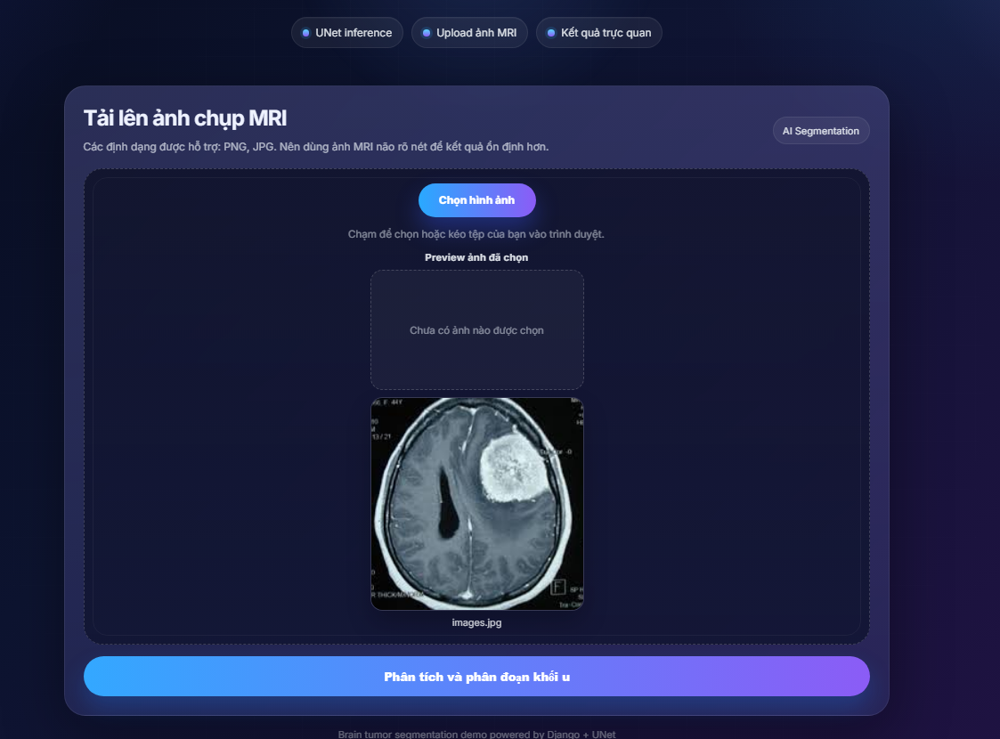
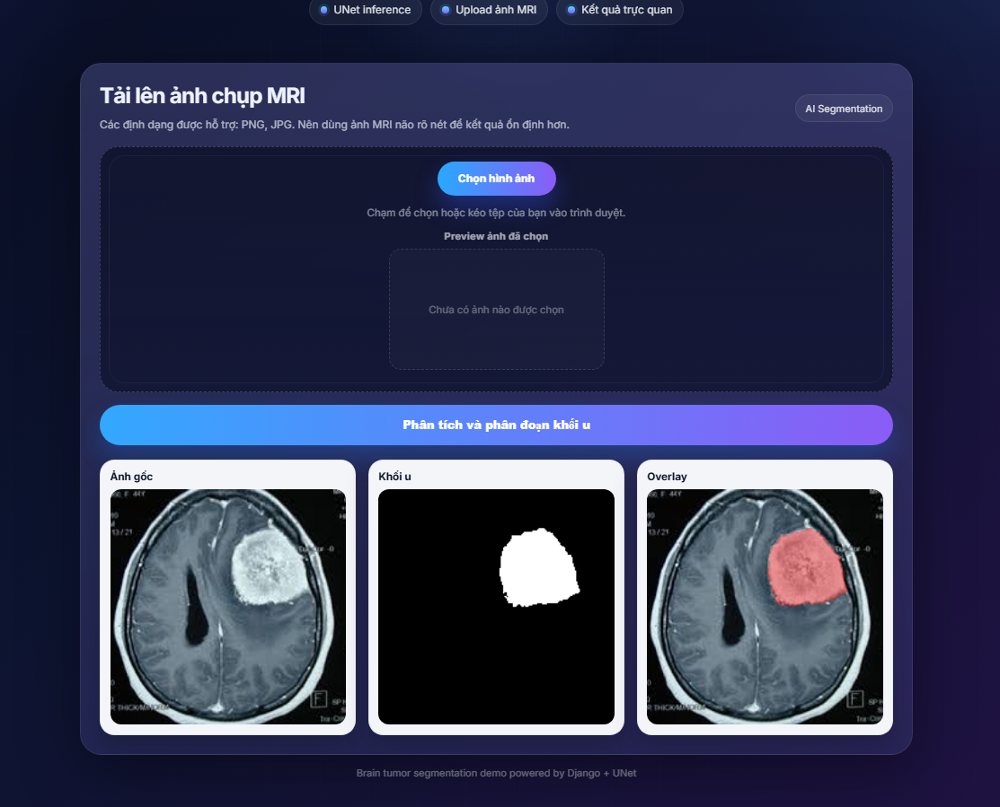

# Brain Tumor Segmentation

Project này dùng U-Net để phân đoạn khối u não từ ảnh MRI grayscale. Repo gồm 2 phần chính:

- Huấn luyện và đánh giá model bằng PyTorch
- Demo web bằng Django để upload ảnh và xem kết quả phân đoạn

## Tính năng

- Huấn luyện mô hình U-Net trên tập ảnh MRI và mask tương ứng
- Lưu checkpoint huấn luyện và best model
- Tính các chỉ số Dice và IoU
- Chạy suy luận trên ảnh test thủ công bằng script Python
- Chạy demo web để upload ảnh và xem ảnh gốc, mask dự đoán, overlay

## Kiến trúc U-Net

Mô hình trong repo là một biến thể U-Net cho ảnh grayscale 1 channel. Luồng xử lý chính như sau:

- Encoder dùng các khối `ConvBlock` gồm 2 lớp `Conv2d + BatchNorm + ReLU`
- Sau mỗi mức encoder có `MaxPool2d(2)` để giảm kích thước không gian
- Bottleneck dùng `ConvBlock(512, 512)` kèm `Dropout2d(p=0.3)`
- Decoder dùng các `UpBlock` với `ConvTranspose2d` để upsample và nối skip connection
- Đầu ra cuối cùng là `Conv2d(32, 1, kernel_size=1)` để sinh mask nhị phân

Kiến trúc này giữ đúng tinh thần U-Net cổ điển: encoder lấy ngữ cảnh, decoder phục hồi chi tiết, còn skip connection giúp giữ thông tin biên của khối u.



## Loss

Script train dùng hàm loss kết hợp trong [loss_function.py](loss_function.py):

- `BCEWithLogitsLoss` để tối ưu phân lớp pixel-wise
- Dice loss để giảm mất cân bằng lớp giữa nền và vùng khối u

Công thức tổng quát:

```text
combined_loss = BCEWithLogitsLoss + Dice loss
```



## Metric

Hai metric chính được theo dõi trong train và validation là:

- Dice coefficient
- IoU coefficient

Cách tính nằm trong [metric.py](metric.py). Cả hai metric đều chuyển đầu ra logits qua sigmoid rồi threshold ở 0.5 để tạo mask nhị phân trước khi tính điểm.

### Dice score



### IoU score



## Cấu trúc thư mục

```text
.
├── brain_dataset.py
├── loss_function.py
├── metric.py
├── train.py
├── test.py
├── unet.py
├── best_model.pt
├── trained_models/
├── tensorboard/
├── datasets/
│   ├── train/
│   │   ├── images/
│   │   └── masks/
│   ├── val/
│   │   ├── images/
│   │   └── masks/
│   └── test/
│       ├── images/
│       └── masks/
└── django_site/
    ├── manage.py
    ├── brain_tumor_web/
    └── segmentation/
```

## Yêu cầu môi trường

Project hiện đang dùng Python 3.12 và các gói trong `requirements.txt`, gồm PyTorch, Albumentations, OpenCV, Django, TensorBoard và scikit-learn.

## Cài đặt

Tạo môi trường ảo và cài dependencies:

```bash
python -m venv env
env\Scripts\activate
pip install -r requirements.txt
```

Nếu bạn đã có sẵn môi trường `env` trong repo, chỉ cần kích hoạt rồi cài dependencies nếu cần.

## Dữ liệu

Script huấn luyện mong đợi dữ liệu theo cấu trúc sau:

```text
datasets/
  train/
    images/
    masks/
  val/
    images/
    masks/
  test/
    images/
    masks/
```

Ảnh đầu vào và mask phải được sắp xếp theo cùng thứ tự tên file để ghép đúng cặp.

## Huấn luyện model

Chạy từ thư mục gốc:

```bash
python train.py
```

Tham số có thể truyền thêm:

- `--data_path_train` đường dẫn thư mục train, mặc định `datasets/train`
- `--data_path_val` đường dẫn thư mục validation, mặc định `datasets/val`
- `--nums_epoch` số epoch, mặc định `50`
- `--batch_size` kích thước batch, mặc định `4`
- `--learning_rate` learning rate, mặc định `0.001`
- `--log_folder` thư mục TensorBoard, mặc định `tensorboard/brain_tumor_unet`
- `--checkpoint_folder` thư mục lưu checkpoint, mặc định `trained_models`
- `--best_model_path` đường dẫn lưu best model, mặc định `best_model.pt`

Trong quá trình train, script sẽ:

- Tự động dùng GPU nếu có, ngược lại dùng CPU
- Lưu checkpoint cuối cùng tại `trained_models/last_model.pt`
- Lưu model tốt nhất theo validation loss tại `best_model.pt`
- Ghi log lên TensorBoard

## Xem log TensorBoard

Sau khi train, mở TensorBoard bằng:

```bash
tensorboard --logdir tensorboard/brain_tumor_unet
```

### Kết quả huấn luyện

Ảnh dưới đây là log huấn luyện thực tế đã lưu trong repo:



Dựa trên các biểu đồ TensorBoard hiện có, mô hình đang hội tụ khá ổn định:

- Dice train đạt khoảng `0.87`
- Dice val đạt khoảng `0.86`
- IoU train đạt khoảng `0.78`
- IoU val đạt khoảng `0.80`
- Loss train giảm xuống khoảng `0.15`
- Loss val giảm xuống khoảng `0.39`

Các đường cong cho thấy loss giảm đều, còn Dice/IoU tăng dần theo epoch, phù hợp với một mô hình segmentation đang học tốt.

## Giao diện web

Trang web Django cho phép upload ảnh MRI và xem kết quả trực tiếp trên trình duyệt.



## Ảnh test

Ảnh test thủ công trong repo được dùng để kiểm tra model bằng `test.py`.




## Kết quả dự đoán

Sau khi upload ảnh, hệ thống trả về ảnh gốc, mask dự đoán và ảnh overlay.




## Suy luận thủ công

File `test.py` hiện được viết theo kiểu thử nhanh một ảnh và một mask có sẵn. Trước khi chạy, bạn cần sửa trực tiếp các biến sau trong file:

- `image_path`
- `mask_path`
- `model_path`

Sau đó chạy:

```bash
python test.py
```

Script sẽ hiển thị:

- Ảnh gốc
- Ground truth mask
- Mask dự đoán
- Overlay giữa ảnh và vùng khối u dự đoán

## Chạy web demo Django

Web app nằm trong thư mục `django_site/` và sử dụng model tại `best_model.pt` ở thư mục gốc.

Chạy server:

```bash
cd django_site
python manage.py runserver
```

Mở trình duyệt tại địa chỉ hiển thị trong terminal, thường là:

```text
http://127.0.0.1:8000/
```

Tại trang web, bạn có thể upload ảnh MRI và nhận lại:

- Ảnh gốc
- Mask khối u
- Ảnh overlay

## Ghi chú kỹ thuật

- Mô hình hiện tại nhận ảnh grayscale 1 channel và resize về `256x256`
- Loss dùng kết hợp `BCEWithLogitsLoss` và Dice loss
- Metric gồm Dice coefficient và IoU
- Nếu không có checkpoint, training sẽ bắt đầu từ đầu

## Lưu ý

- `best_model.pt` phải tồn tại ở thư mục gốc để web demo hoạt động
- Nếu bạn đổi tên hoặc di chuyển model, hãy cập nhật lại đường dẫn trong `django_site/segmentation/views.py`
- Dữ liệu train/val/test nên được chuẩn hóa đúng cấu trúc để script đọc file không lỗi
